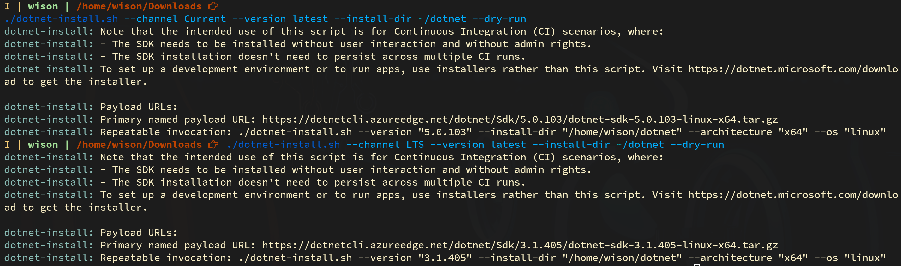

# How to write `.Net` console application in `Arch`

## Install `.Net Core` runtime and SDK

The first thing first is download [`dotnet-install.sh`](https://dot.net/v1/dotnet-install.sh).
After that, can run the command below to print the help info:

```bash
./dotnet-install.sh --help
```

Before you decide to to a real installation, you can run the install command with the `--dry-run`
flag, it will ONLY prints out the install version and download link for you:

```bash
# If you want to see what version means by the `LTS`
./dotnet-install.sh --channel LTS --version latest --install-dir ~/dotnet --dry-run

# If you want to see what version means by the `Current`
./dotnet-install.sh --channel Current --version latest --install-dir ~/dotnet --dry-run
```

It will print out the version info like below:



</br>

After that, you can run the command without `--dry-run` to do a real installation like below:

```bash
./dotnet-install.sh --channel Current --version latest --install-dir ~/dotnet
```

</br>

## How to print `.Net Core` information

```bash
dotnet --info

# .NET SDK (reflecting any global.json):
#  Version:   5.0.103
#  Commit:    72dec52dbd
# 
# Runtime Environment:
#  OS Name:     arch
#  OS Version:
#  OS Platform: Linux
#  RID:         arch-x64
#  Base Path:   /home/wison/dotnet/sdk/5.0.103/
# 
# Host (useful for support):
#   Version: 5.0.3
#   Commit:  c636bbdc8a
# 
# .NET SDKs installed:
#   5.0.103 [/home/wison/dotnet/sdk]
# 
# .NET runtimes installed:
#   Microsoft.AspNetCore.App 5.0.3 [/home/wison/dotnet/shared/Microsoft.AspNetCore.App]
#   Microsoft.NETCore.App 5.0.3 [/home/wison/dotnet/shared/Microsoft.NETCore.App]
# 
# To install additional .NET runtimes or SDKs:
#   https://aka.ms/dotnet-download
```
</br>

```bash
dotnet --list-sdks
# 5.0.103 [/home/wison/dotnet/sdk]

dotnet --list-runtimes
# Microsoft.AspNetCore.App 5.0.3 [/home/wison/dotnet/shared/Microsoft.AspNetCore.App]
# Microsoft.NETCore.App 5.0.3 [/home/wison/dotnet/shared/Microsoft.NETCore.App]
```

</br>

## Create new `.Net Core` console template application

When creating `.Net Core` project, you can run the command below to list all templates supported:

```bash
./dotnet new --list

# Templates                                         Short Name          Language          Tags
# --------------------------------------------      --------------      ------------      ----------------------
# Console Application                               console             [C#], F#, VB      Common/Console
# Class library                                     classlib            [C#], F#, VB      Common/Library
# Worker Service                                    worker              [C#], F#          Common/Worker/Web
# Unit Test Project                                 mstest              [C#], F#, VB      Test/MSTest
# NUnit 3 Test Project                              nunit               [C#], F#, VB      Test/NUnit
# NUnit 3 Test Item                                 nunit-test          [C#], F#, VB      Test/NUnit
# xUnit Test Project                                xunit               [C#], F#, VB      Test/xUnit
# Razor Component                                   razorcomponent      [C#]              Web/ASP.NET
# Razor Page                                        page                [C#]              Web/ASP.NET
# MVC ViewImports                                   viewimports         [C#]              Web/ASP.NET
# MVC ViewStart                                     viewstart           [C#]              Web/ASP.NET
# Blazor Server App                                 blazorserver        [C#]              Web/Blazor
# Blazor WebAssembly App                            blazorwasm          [C#]              Web/Blazor/WebAssembly
# ASP.NET Core Empty                                web                 [C#], F#          Web/Empty
# ASP.NET Core Web App (Model-View-Controller)      mvc                 [C#], F#          Web/MVC
# ASP.NET Core Web App                              webapp              [C#]              Web/MVC/Razor Pages
# ASP.NET Core with Angular                         angular             [C#]              Web/MVC/SPA
# ASP.NET Core with React.js                        react               [C#]              Web/MVC/SPA
# ASP.NET Core with React.js and Redux              reactredux          [C#]              Web/MVC/SPA
# Razor Class Library                               razorclasslib       [C#]              Web/Razor/Library
# ASP.NET Core Web API                              webapi              [C#], F#          Web/WebAPI
# ASP.NET Core gRPC Service                         grpc                [C#]              Web/gRPC
# dotnet gitignore file                             gitignore                             Config
# global.json file                                  globaljson                            Config
# NuGet Config                                      nugetconfig                           Config
# Dotnet local tool manifest file                   tool-manifest                         Config
# Web Config                                        webconfig                             Config
# Solution File                                     sln                                   Solution
# Protocol Buffer File                              proto                                 Web/gRPC
```

For example, let's create a new `console` application project by running:

```bash
cd ~/CSharp/demo
dotnet new console
```

</br>

## Run `.Net Core` application

```bash
# Make sure you're in the current project root folder
clear && dotnet run
```
